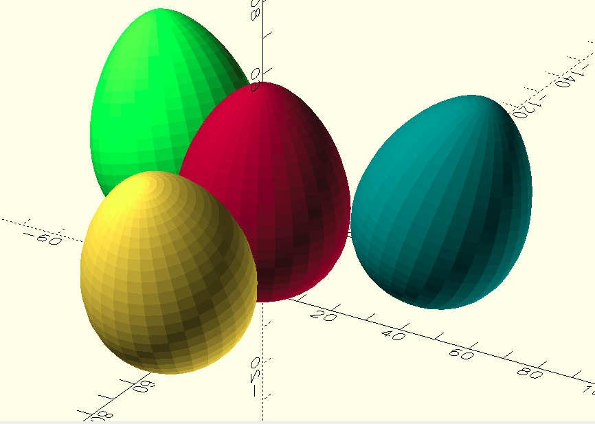

Shield: [![CC BY-NC-SA 4.0][cc-by-nc-sa-shield]][cc-by-nc-sa]
<!-- Thanks to this Guy: https://github.com/santisoler/cc-licenses?tab=readme-ov-file#cc-attribution-noncommercial-sharealike-40-international-->
This work is licensed under a
[Creative Commons Attribution-NonCommercial-ShareAlike 4.0 International License][cc-by-nc-sa].

[![CC BY-NC-SA 4.0][cc-by-nc-sa-image]][cc-by-nc-sa]

[cc-by-nc-sa]: http://creativecommons.org/licenses/by-nc-sa/4.0/
[cc-by-nc-sa-image]: https://licensebuttons.net/l/by-nc-sa/4.0/88x31.png
[cc-by-nc-sa-shield]: https://img.shields.io/badge/License-CC%20BY--NC--SA%204.0-lightgrey.svg

# Customizable Easter Egg 3D Model

    

The model was designed for producing on a 3D printer.

⚠️ **In case of any questions** – do not hesitate to contact the author in Telegram group ([see below](#contact-me)) and ask.

## HOWTO

⚠️ Before assembling read the topic to the bottom!

This 3D model is highly customizable. So you can configure it for you needs.

### Pre-rendered STL

There are the next options, depending on "Rendering Type":
* "Whole Egg" – https://t.me/YarickWorkshop/645;
* "Two Halves" – https://t.me/YarickWorkshop/646.

### Model Parameters

I used self-explanatory names for OpenSCAD model parameters. But if you still have any questions – [contact me](#contact-me).

A video with explanation of the model parameters (in Russian, but with English subtitles): https://youtu.be/cFKoWXV_shI

*I tried to do my best translating subtitles to English. But if you see something could be fixed - [let me know](#contact-me), please! And I will update the text. The same for this article as well. Thank you in advance!*

### Print Settings

Up to you! I think 0.2mm layer thickness will be normal, but 0.1mm would be better!

### Assembling

In case of the "Whole Egg" rendering type, simply remove the stands and use. 
But if you are printing the "Two Halves" version, glue the printed two halves of the egg together.

## Contact me

To follow the progress go to my channels:
  - Telegram: [https://t.me/YarickWorkshop](https://t.me/YarickWorkshop/644)
  - YouTube: https://www.youtube.com/@yarick-workshop

Yeah, they both are in Russian.

**If you have any questions** – contact me in either Telegram channel (see above) or Mail: techno.man.983@gmail.com. I can communicate in English without any problems. 

⚠️ **Pay attention**: I do not answer to any comments on YouTube (despite I read them). Why? It is a HUGE secret 🙃

